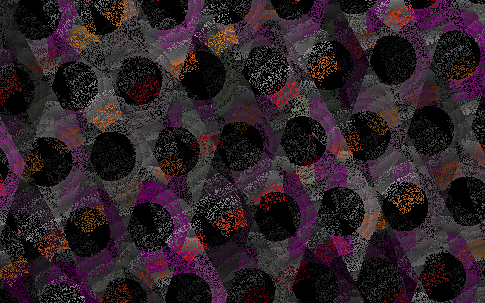
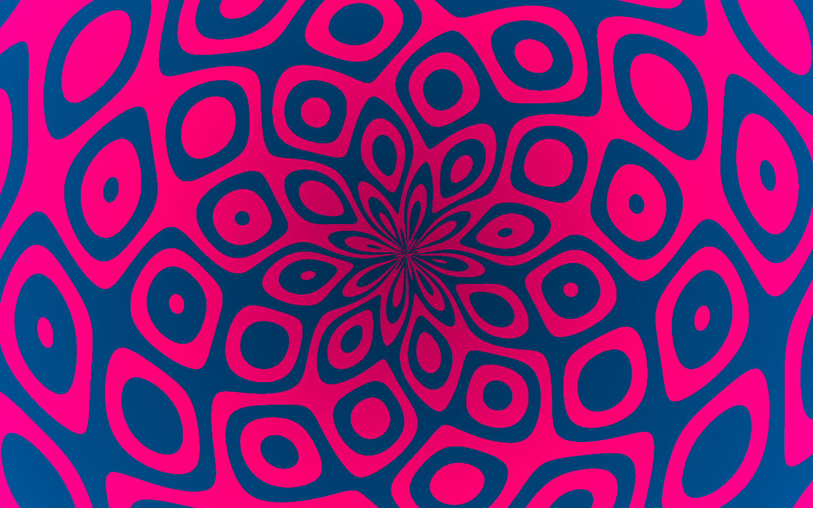
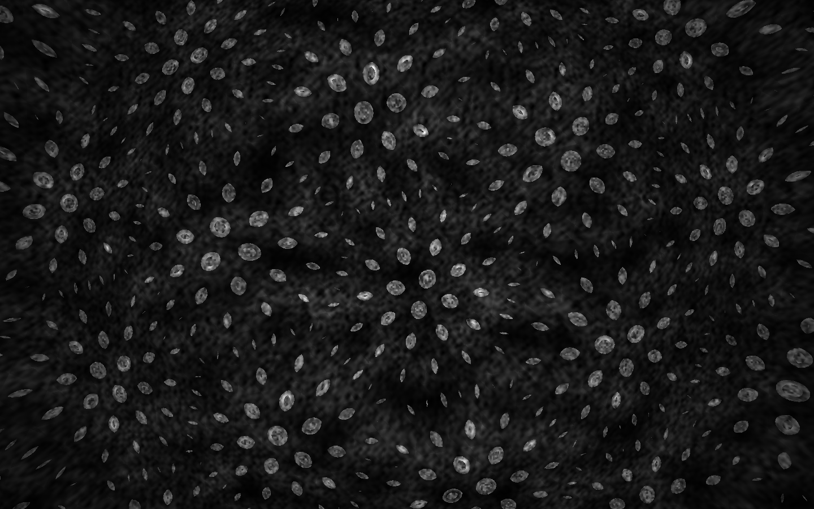
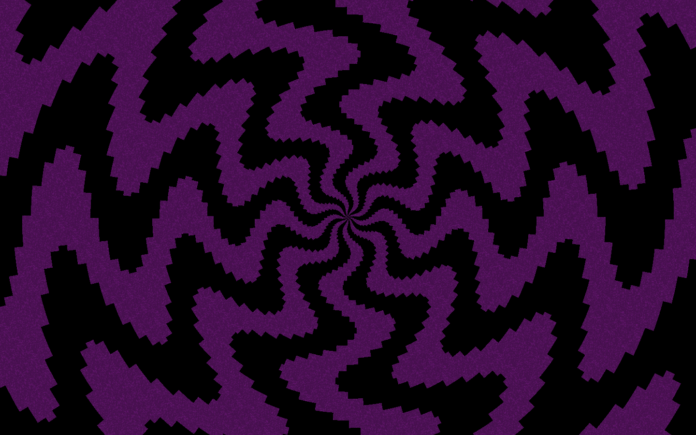
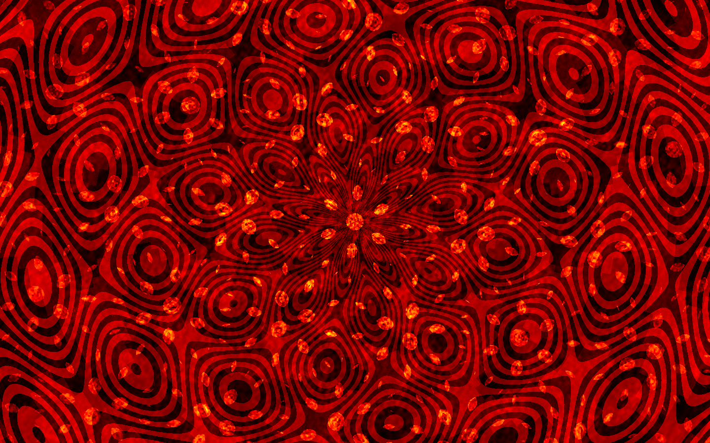
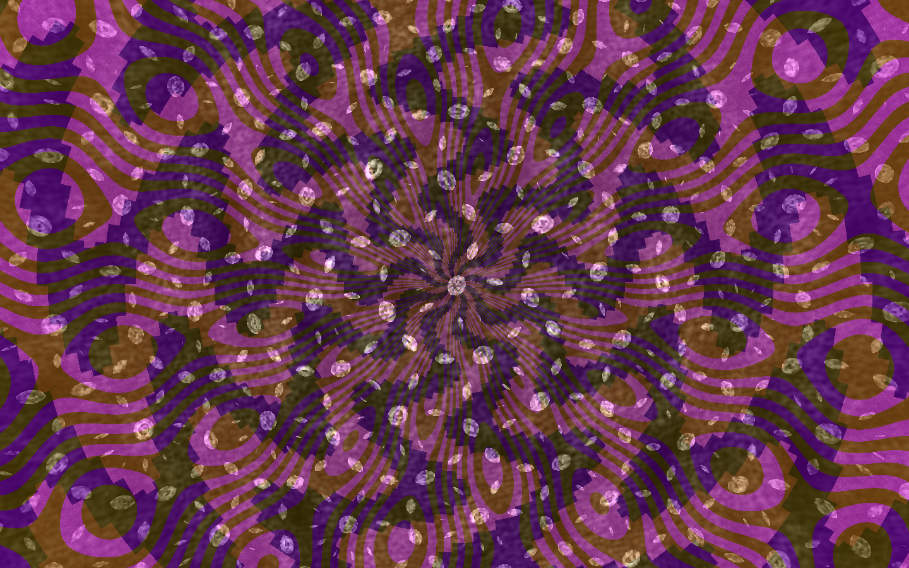
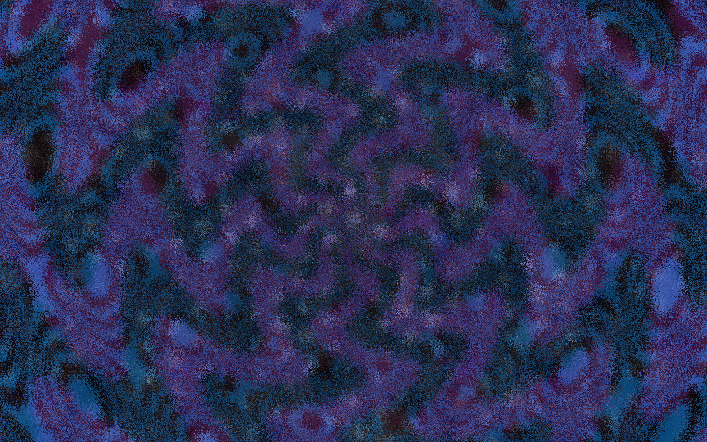
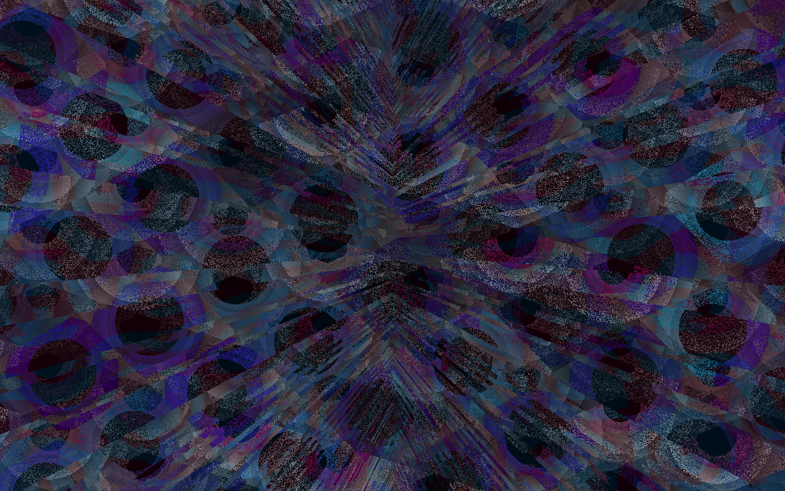
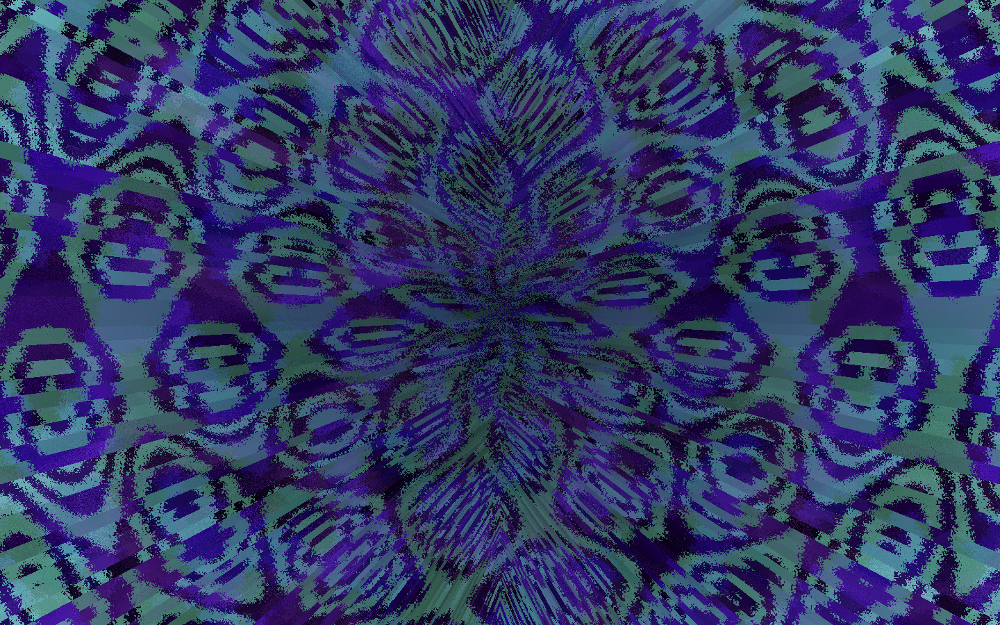
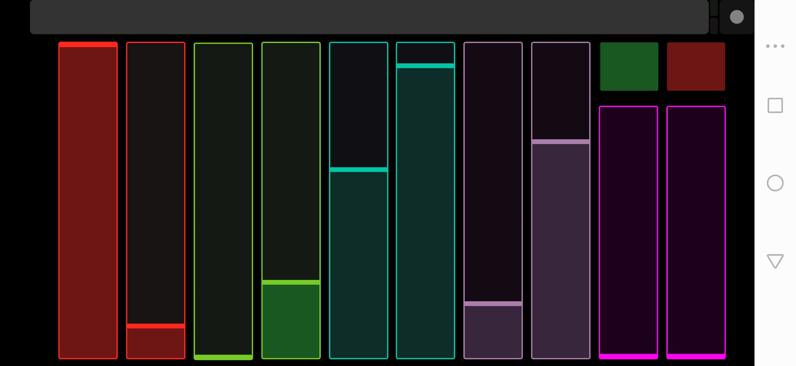

# escapism

escapism is a MIDI-controlled VJ system, written for [Ääniaalto](https://aaniaalto.fi/) IV in Processing & GLSL. mostly GLSL though, so that my struggling 2013 laptop can spend its CPU cycles on music.

it has four animated patterns (some old [shadertoy sketches](https://www.shadertoy.com/user/ahihi))…

ever watchful (CC 30)

bubbly (CC 31)

perforations (CC 32)

shifty (CC 33)

these can be mixed additively, and altered with four effects…

redyellow (CC 34)

hueshift (CC 35)

crunch (CC 36)

quantize (CC 37)

maybe a bit of everything?

i use escapism with [TouchOSC](https://hexler.net/software/touchosc) and my Untitled 2 layout

but any MIDI controller should work (by changing `midi_device` in the sketch)
